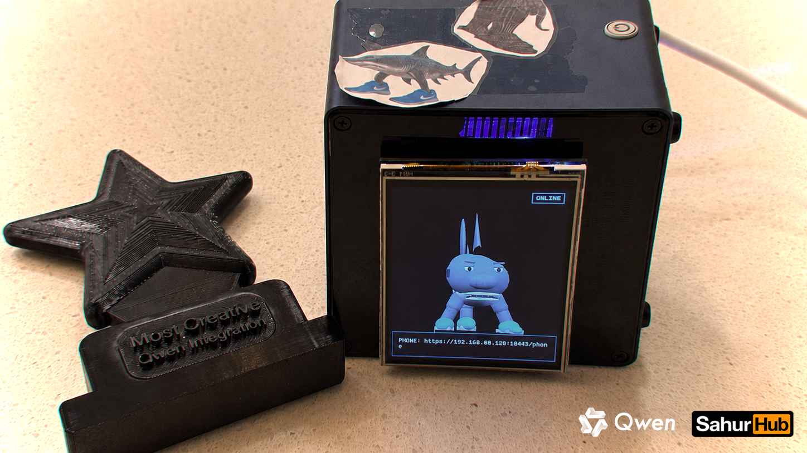
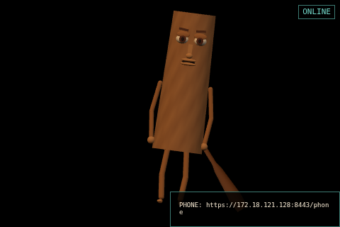
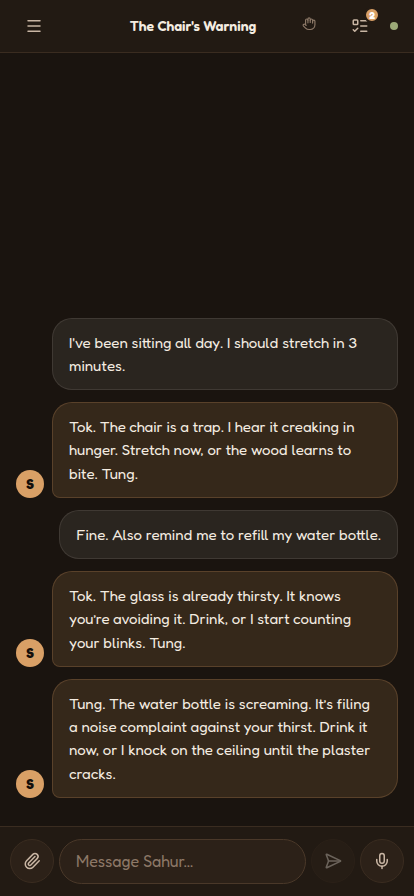
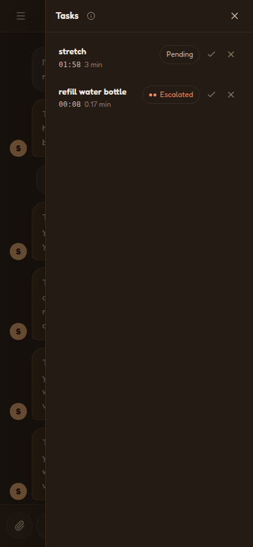
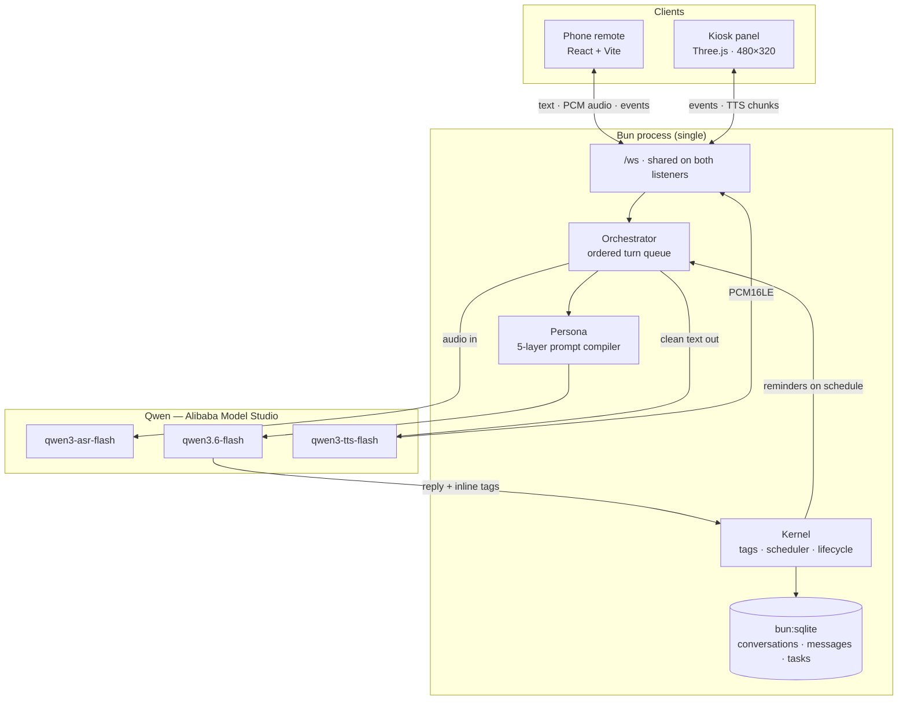

<a id="readme-top"></a>

<!-- PROJECT BANNER -->
<div align="center">
  

  <h3>SahurHub</h3>

  <p>
    <b>A task reminder that works perfectly, and behaves completely unhinged about it.</b><br />
    Talk normally. It captures the task. Then it will not let it go.
  </p>

  <!-- Badges -->


  <!-- Quick links -->

[Pitch Deck](demo/pitch-deck.pdf) · [Demo Script](demo/pitch-script.md) · [PRD](prd.md) · [TRD](trd.md) · [Runbook](runbook.md)

</div>

<!-- TABLE OF CONTENTS -->

## Table of Contents

<details>
  <summary>Expand</summary>
  <ol>
    <li><a href="#about-the-project">About The Project</a></li>
    <li>
      <a href="#screenshots">Screenshots</a>
      <ul>
        <li><a href="#the-kiosk">The Kiosk</a></li>
        <li><a href="#the-remote">The Remote</a></li>
      </ul>
    </li>
    <li><a href="#how-it-works">How It Works</a></li>
    <li><a href="#features">Features</a></li>
    <li>
      <a href="#architecture">Architecture</a>
      <ul>
        <li><a href="#the-split-brain">The Split Brain</a></li>
        <li><a href="#the-tag-grammar">The Tag Grammar</a></li>
        <li><a href="#the-task-lifecycle">The Task Lifecycle</a></li>
      </ul>
    </li>
    <li><a href="#tech-stack">Tech Stack</a></li>
    <li><a href="#hardware">Hardware</a></li>
    <li>
      <a href="#getting-started">Getting Started</a>
      <ul>
        <li><a href="#prerequisites">Prerequisites</a></li>
        <li><a href="#installation">Installation</a></li>
        <li><a href="#daily-loop">Daily Loop</a></li>
      </ul>
    </li>
    <li><a href="#configuration">Configuration</a></li>
    <li><a href="#building-the-device">Building The Device</a></li>
    <li><a href="#project-structure">Project Structure</a></li>
    <li><a href="#license">License</a></li>
    <li><a href="#team">Team</a></li>
    <li><a href="#acknowledgments">Acknowledgments</a></li>
  </ol>
</details>

<!-- ABOUT THE PROJECT -->

## About The Project

**SahurHub** is a palm-sized desk companion: an animated 3D character living on a Raspberry Pi panel, driven end to end by Qwen. You talk to it from your phone. It talks back.

There is **no "add task" button**. You mention in passing that you should stretch in three minutes — it quietly captures that, schedules it, and then follows up. And follows up. And escalates.

The design principle is a **sincerity inversion**, and it is the whole product:

|                   | Behavior                                                                  |
| ----------------- | ------------------------------------------------------------------------- |
| **The engine**    | Never drops a task, never mistimes a follow-up. Task facts stay accurate. |
| **The character** | Completely deranged about all of it. Escalating percussion menace.        |

The engine is the straight man. The character is the bit. **The bit never breaks the tool.**

Built for the [Qwen Brainrot Hackathon 2026](https://finals-qbh.damnitjoshua.workers.dev) — a competition whose brief is to build something deliberately useless that nonetheless genuinely works. SahurHub won **Most Creative Qwen Integration** at the Physical Final.

<p align="right"><a href="#readme-top">&uarr;</a></p>

<!-- SCREENSHOTS -->

## Screenshots

### The Kiosk

<div align="center">
  
  <p><sub>Three.js Sahur at the panel's native <b>480×320</b>, with the connection badge and the phone URL to join from. On the device this runs rotated to upright portrait; tapping the badge shows a scannable QR.</sub></p>
</div>

### The Remote

|                                                  Conversation                                                  |                                                              Tasks                                                               |
| :------------------------------------------------------------------------------------------------------------: | :------------------------------------------------------------------------------------------------------------------------------: |
|  |  |
|                <sub>Two tasks captured from ordinary conversation — no command, no form.</sub>                 |                     <sub>Live countdowns and escalation state: the deterministic half, doing its job.</sub>                      |

<p align="right"><a href="#readme-top">&uarr;</a></p>

<!-- HOW IT WORKS -->

## How It Works

### 1. Speak Or Type

Hold-to-talk from the phone, or just type. Audio goes to `qwen3-asr-flash`.

### 2. One Generation Does Everything

`qwen3.6-flash` streams the reply **and** its control tags in the same pass — no second classifier call, no JSON mode. Task capture is a side effect of talking.

### 3. The Kernel Takes Over

A captured task is scoped to its conversation and scheduled from its duration. The scheduler is plain deterministic code; the model never touches timing.

### 4. The Character Escalates

Reminders fire on schedule. Each ignored one advances an escalation level and re-arms. The wording gets worse; the facts do not change.

### 5. Sahur Reacts On The Panel

The kiosk consumes the same event stream: expression poses, amplitude-driven lip-sync, and a knock animation whose intensity tracks the escalation tier.

<p align="right"><a href="#readme-top">&uarr;</a></p>

<!-- FEATURES -->

## Features

- 🎙️ **Voice and text, both** — hold-to-talk push-to-talk or plain typing, with barge-in that cuts an in-flight reply mid-sentence.
- 🪤 **Task capture without a command** — tasks are extracted from ordinary conversational context. No add-task syntax to learn, and no second model call to pay for.
- ⏰ **Deterministic escalation** — `pending → reminding → escalated ×2 → missed`, driven by a timer kernel that rebuilds itself from SQLite after a restart.
- 🎭 **Two characters, one seam** — **Sahur** (wooden log, percussion menace) and **Tralala** (blue sneakers, cardio menace). Each is a manifest plus a character bible; prompt, voice, colors, and animations all key off it.
- 🧱 **Procedural 3D, zero asset pipeline** — the characters are composed from Three.js primitives in code. Nothing to download, nothing to rig, and it re-builds from scratch inside the 2-hour finals window.
- 👉 **Poke to retaliate** — tap the character on the panel or from the phone and it swipes back, interrupting whatever it was saying.
- 🖼️ **Uploads with a vision lane** — text and images up to 5 MB; text enters context, images go through Qwen vision. Failures degrade to an in-character line instead of crashing.
- 🔊 **Audio follows you** — exactly one playback target at a time, Phone or Device, while the kiosk keeps receiving amplitude data for lip-sync either way.
- 💬 **Real conversations** — multiple threads, async-generated titles, editable and deletable, persisted in `bun:sqlite`.
- 🌗 **Polished remote** — light/dark tokens with no flash on load, self-hosted Fredoka, and a hand-rolled markdown renderer that never touches `dangerouslySetInnerHTML`.
- 🥁 **Soundboard stings** — task-completion and entrance beats, because the alternative was silence.

<p align="right"><a href="#readme-top">&uarr;</a></p>

<!-- ARCHITECTURE -->

## Architecture

**One Bun process.** It runs a plain HTTP listener for the kiosk, an mkcert-backed HTTPS listener for the phone (browser mic capture requires it), and a shared `/ws` endpoint on both.



### The Split Brain

The separation that makes the joke safe to ship:

| Owned By              | What It Controls                                                               |
| --------------------- | ------------------------------------------------------------------------------ |
| **The kernel** (code) | Task existence, durations, wake times, escalation level, lifecycle transitions |
| **The model** (Qwen)  | Every word spoken, the expression, the animation trigger                       |

The model can _request_ a task via a tag, but the kernel owns the clock. A hallucinating model produces worse jokes — never a missed reminder.

### The Tag Grammar

Control flows as **streaming text, not JSON**. The reply and its side effects arrive in one generation:

```text
Tok. The chair is a trap. <|emotion:smug|> Stretch now. <|task:stretch|3|>
```

| Tag         | Args            | Effect                                                 |
| ----------- | --------------- | ------------------------------------------------------ |
| `emotion`   | name            | Sets the expression pose on the panel                  |
| `task`      | `name\|minutes` | Captures a task and schedules it                       |
| `task_done` | reference       | Completes an active task by id, id-prefix, or name     |
| `remind`    | minutes         | Fires the character's remind animation (knock / stomp) |
| `escalate`  | —               | Fires the escalate animation (posture shift / strut)   |
| `schedule`  | minutes         | Emits a schedule event, played immediately             |

Each character's manifest maps `remind` and `escalate` onto its own animation, so the same tag reads as a **knock** from Sahur and a **stomp** from Tralala.

The parser strips tag-shaped garbage from visible text, holds a trailing partial tag across streamed chunks, bounds every argument, and deduplicates events per turn. **Malformed output degrades to plain speech** rather than an error.

### The Task Lifecycle

| State                | Kernel Behavior                                                      |
| -------------------- | -------------------------------------------------------------------- |
| `pending`            | First duration interval elapses                                      |
| `reminding`          | Reminder emitted; next wake is one duration later                    |
| `escalated` 1, 2     | Each ignored follow-up advances a level and re-arms for one duration |
| `missed`             | A third ignored state ends the task and clears its wake time         |
| `done` / `dismissed` | Terminal manual actions that cancel scheduling                       |

<p align="right"><a href="#readme-top">&uarr;</a></p>

<!-- TECH STACK -->

## Tech Stack

| Layer           | Technologies                                                                    |
| --------------- | ------------------------------------------------------------------------------- |
| **Runtime**     | Bun · TypeScript · Bun workspaces · Biome + Prettier                            |
| **Server**      | Dual HTTP/HTTPS listeners · shared WebSocket · `bun:sqlite` · zero runtime deps |
| **AI**          | `qwen3-asr-flash` → `qwen3.6-flash` → `qwen3-tts-flash`                         |
| **Kiosk**       | Three.js · procedural primitive model · amplitude-driven lip-sync               |
| **Remote**      | React 19 · Vite · hand-rolled CSS tokens · self-hosted Fredoka                  |
| **Device**      | Raspberry Pi 5 · Waveshare 3.5" SPI panel · labwc kiosk · systemd               |
| **Local HTTPS** | mkcert · Avahi mDNS (`sahurhub.local`)                                          |

<p align="right"><a href="#readme-top">&uarr;</a></p>

<!-- HARDWARE -->

## Hardware

| Component                              | Purpose                        |
| -------------------------------------- | ------------------------------ |
| Raspberry Pi 5                         | Device host                    |
| Official Pi 5 PSU                      | Required for stable demo power |
| Waveshare 3.5" RPi LCD (A) Rev4.0, SPI | ILI9486 + XPT2046 panel        |
| USB speaker                            | Device-side audio output       |
| Phone hotspot                          | Demo network and remote access |

> **No microphone or camera on the device.** The phone webapp supplies text, push-to-talk audio, and uploads — which is also why the phone listener has to be HTTPS.

**Want to build one?** The [runbook](runbook.md) walks the whole thing top to bottom: assembly, SD-card flashing, provisioning, and operation.

<p align="right"><a href="#readme-top">&uarr;</a></p>

<!-- GETTING STARTED -->

## Getting Started

The app runs **fully offline without an API key** — a deterministic mock brain drives the whole UI, kiosk, and scheduler. Add a key only when you want real Qwen.

### Prerequisites

- **[Bun](https://bun.sh/)** — package manager and runtime
- **[mkcert](https://github.com/FiloSottile/mkcert)** — for the local HTTPS certificate
- A POSIX shell (the setup scripts are bash)

### Installation

**1. Install mkcert** (Debian/Ubuntu/WSL2)

```bash
sudo apt update && sudo apt install -y libnss3-tools
curl -JLO https://dl.filippo.io/mkcert/latest?for=linux/amd64
chmod +x mkcert-v*-linux-amd64 && sudo mv mkcert-v*-linux-amd64 /usr/local/bin/mkcert
```

**2. Bootstrap the repository**

```bash
git clone https://github.com/TolongLabs/SahurHub
cd SahurHub
./scripts/setup.sh
```

That runs `bun install`, builds both browser apps, installs the mkcert CA, mints `cert/` with SANs for localhost + your LAN IP + `sahurhub.local`, and scaffolds `.env.local` without overwriting an existing one.

### Daily Loop

```bash
bun run dev
```

| Surface    | URL                            | Notes                                            |
| ---------- | ------------------------------ | ------------------------------------------------ |
| **Kiosk**  | `http://localhost:8080/`       | Preview at **480×320** in the device toolbar     |
| **Remote** | `https://localhost:8443/phone` | The `/phone` path is required — `/` is the kiosk |

| Command                | Purpose                                      |
| ---------------------- | -------------------------------------------- |
| `bun run dev`          | Run the server                               |
| `bun run dev:remote`   | Vite dev server for the remote app, with HMR |
| `bun run build:remote` | Build the app served at `/phone`             |
| `bun run build:kiosk`  | Build the kiosk bundle                       |
| `bun test`             | Run tests                                    |
| `bun run typecheck`    | Type-check without emitting                  |
| `bun run lint`         | Biome checks                                 |

> **WSL2:** WebGL is commonly blocklisted under WSLg, so the kiosk shows `RENDERER ERROR`. Use the Windows browser against the forwarded `localhost` instead. Full notes in the [runbook](runbook.md).

<p align="right"><a href="#readme-top">&uarr;</a></p>

<!-- CONFIGURATION -->

## Configuration

All settings live in `.env.local`, which is **never committed**. See [`.env.example`](../.env.example) for the annotated list.

| Variable                       | What It Does                                                       |
| ------------------------------ | ------------------------------------------------------------------ |
| `DASHSCOPE_API_KEY`            | Alibaba Model Studio key. **Blank = mock brain**, no network calls |
| `QWEN_CHAT_MODEL`              | Reply + tag generation — `qwen3.6-flash`                           |
| `QWEN_ASR_MODEL`               | Speech to text — `qwen3-asr-flash`                                 |
| `QWEN_TTS_MODEL`               | Text to speech — `qwen3-tts-flash`                                 |
| `QWEN_VISION_MODEL`            | Image-upload lane                                                  |
| `SAHURHUB_WIFI_SSID` / `_PASS` | Hotspot credentials consumed by `setup-pi.sh`                      |
| `SAHURHUB_STATIC_IP`           | Pin a static LAN address for a stable demo URL                     |

With a key present, each spoken reply costs roughly **$0.002** after the free TTS quota.

`PORT` and `HTTPS_PORT` are shell overrides rather than `.env` entries — use them to run parallel instances:

```bash
PORT=8081 HTTPS_PORT=8444 bun run dev
```

<p align="right"><a href="#readme-top">&uarr;</a></p>

<!-- DEPLOYING TO THE PI -->

## Building The Device

Hardware assembly, SD-card flashing, provisioning, and day-to-day operation all live in one place:

### 📖 **[docs/runbook.md](runbook.md)** — build one yourself, top to bottom

| Section                                                         | Covers                                                        |
| --------------------------------------------------------------- | ------------------------------------------------------------- |
| [Bill Of Materials](runbook.md#2-bill-of-materials)             | Exactly what to buy, and the power supply that trips everyone |
| [Assembling The Hardware](runbook.md#3-assembling-the-hardware) | Seating the 26-pin LCD HAT without bricking the boot          |
| [Flashing The SD Card](runbook.md#4-flashing-the-sd-card)       | Raspberry Pi OS Bookworm 64-bit, and the settings to preset   |
| [Provisioning SahurHub](runbook.md#6-provisioning-sahurhub)     | One idempotent script, and what each stage actually does      |
| [Troubleshooting](runbook.md#13-troubleshooting)                | Hardware, service, model, and network failure modes           |

The short version, on a freshly flashed Pi:

```bash
git clone https://github.com/TolongLabs/SahurHub
cd SahurHub
sudo ./scripts/setup-pi.sh --ssid "<hotspot>" --pass "<password>"
```

<p align="right"><a href="#readme-top">&uarr;</a></p>

<!-- PROJECT STRUCTURE -->

## Project Structure

```text
SahurHub/
├── src/
│   ├── server/
│   │   ├── index.ts        # dual listeners, routes, WS session wiring
│   │   ├── orchestrator.ts # ordered turn queue, barge-in, event dispatch
│   │   ├── kernel/         # tags · scheduler · task lifecycle
│   │   ├── persona/        # character registry + 5-layer prompt compiler
│   │   ├── llm/            # Qwen backends and the offline mock
│   │   └── db/             # bun:sqlite schema and DAO
│   ├── kiosk/              # Three.js panel app + procedural model/
│   └── shared/             # protocol.ts — the sole wire contract
├── apps/remote/            # React + Vite phone webapp (Bun workspace)
├── characters/             # <id>/character.json + bible.md
├── scripts/                # setup.sh · setup-pi.sh · dev-kiosk.sh
├── spikes/                 # qwen-probe · https-mic
├── assets/screenshots/     # the images in this README
└── docs/                   # this README, PRD, TRD, runbook, demo deck
```

<p align="right"><a href="#readme-top">&uarr;</a></p>

<!-- LICENSE -->

## License

Distributed under the MIT License. See [LICENSE](../LICENSE) for details.

<p align="right"><a href="#readme-top">&uarr;</a></p>

<!-- TEAM -->

## Team

Built by **TolongLabs** for the Qwen Brainrot Hackathon 2026.

<div align="center">
<table>
  <tr>
    <td align="center" width="50%">
      <a href="https://github.com/AlaskanTuna"></a><br />
      <b>Tuna</b><br />
      <a href="https://github.com/AlaskanTuna">@AlaskanTuna</a>
    </td>
    <td align="center" width="50%">
      <a href="https://github.com/chaosiris"></a><br />
      <b>Chaos</b><br />
      <a href="https://github.com/chaosiris">@chaosiris</a>
    </td>
  </tr>
  <tr>
    <td align="center"><sub>Software &amp; integration — server, kernel, persona, kiosk, remote.</sub></td>
    <td align="center"><sub>Hardware &amp; assembly — Pi build, panel, enclosure, demo rig.</sub></td>
  </tr>
</table>
</div>

<p align="right"><a href="#readme-top">&uarr;</a></p>

<!-- ACKNOWLEDGMENTS -->

## Acknowledgments

- [Qwen](https://qwen.ai) & [Alibaba Cloud Model Studio](https://www.alibabacloud.com/en/product/modelstudio) — the ASR, chat, and TTS models doing the central work
- [Three.js](https://threejs.org) — the kiosk renderer
- [Bun](https://bun.sh) — runtime, bundler, test runner, and SQLite driver in one binary
- [mkcert](https://github.com/FiloSottile/mkcert) — painless local HTTPS, without which the phone mic would not work
- [Shields.io](https://shields.io) — the badges above

<p align="right"><a href="#readme-top">&uarr;</a></p>
